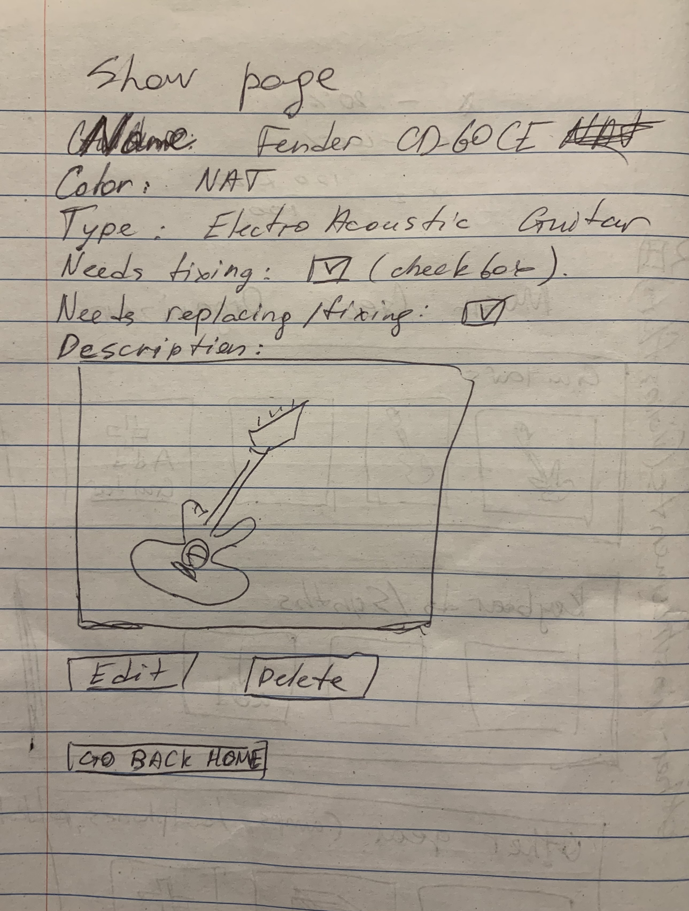

# Music Gear Organizer

## Overview
SEI-19 Project 2: Music Gear Organizer

A web application created for musicians to store and organize their music gear and instruments in one app.

Live site: https://music-gear-organizer.herokuapp.com/gear

## Technologies Used
* Languages - HTML5, CSS3, Javascript
* Libraries - Express, Node.js, Mongoose, Express, EJS
* VS Code

## Features
* Responsive design
* Edit button
* Delete button
* Forms for editing or adding new gear
* Sections with different gear classified by type

## Wireframe

## Future Development
- Debug: when deleting last item from a section DB gives back an error
- Functionality to have a personal private account
- More styling
- Show a template image if user didn't add a URL

## References
- https://www.geeksforgeeks.org/how-to-set-the-default-value-for-an-html-select-element/